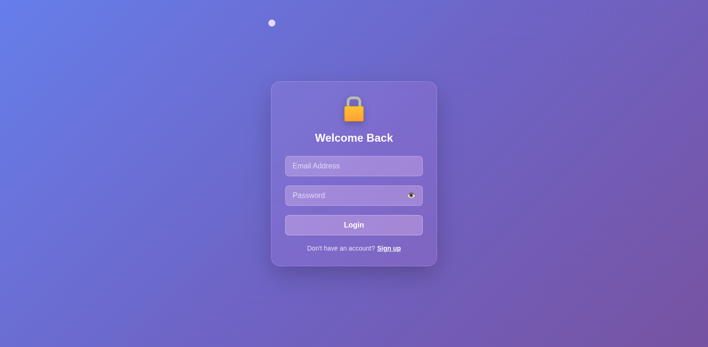

# 🔐 SA Auth Form - Glassmorphism UI Login/Signup

A modern, beautiful, and responsive Login/Signup form built with **HTML, CSS, and JavaScript**.  
This project uses **glassmorphism**, **custom cursor**, and smooth transitions for an elegant user experience.

> ✅ Made as part of my **#60DaysWebDevChallenge**  
> 🔥 Designed with a focus on **UI/UX animation and interactivity**

---

## 🖥️ Live Demo

🌐 **Live Site**: [View on Netlify](https://glassmorphismauthui.netlify.app/)

---

## 📸 Preview

---

## 🚀 Features

- ✨ Glassmorphism styled container
- 👁️ Password visibility toggle
- 🔁 Toggle between Login and Signup forms
- 🧠 Form validation (basic HTML5)
- 🖱️ Custom cursor for enhanced user feel
- 📱 Fully responsive (mobile friendly)

---

